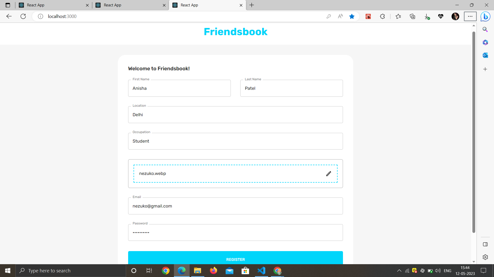
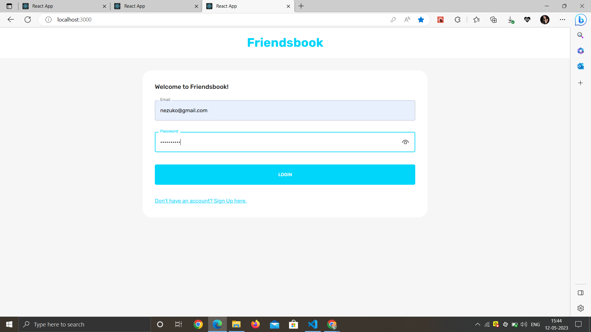
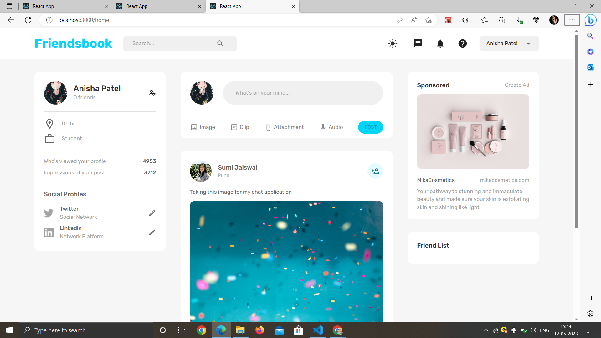
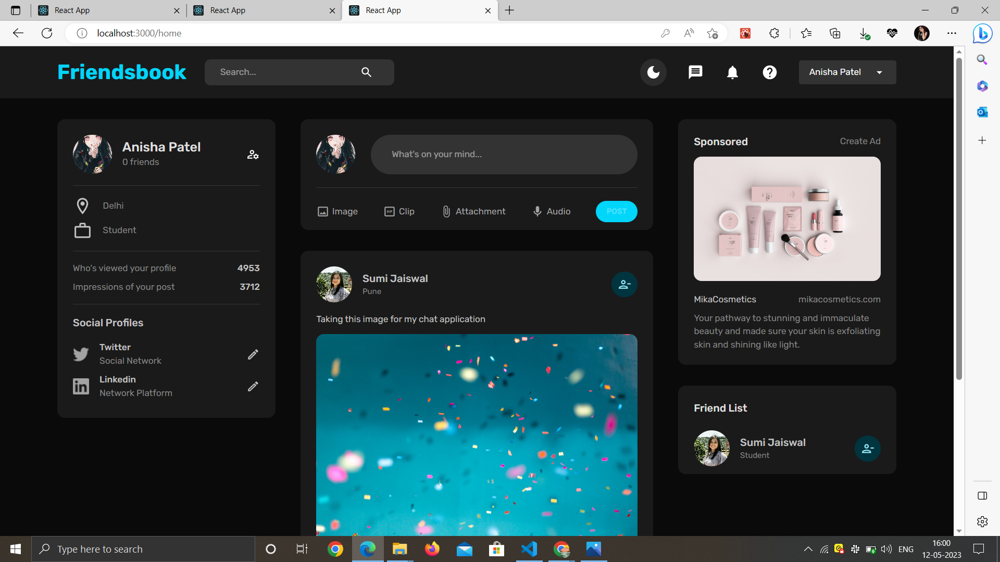
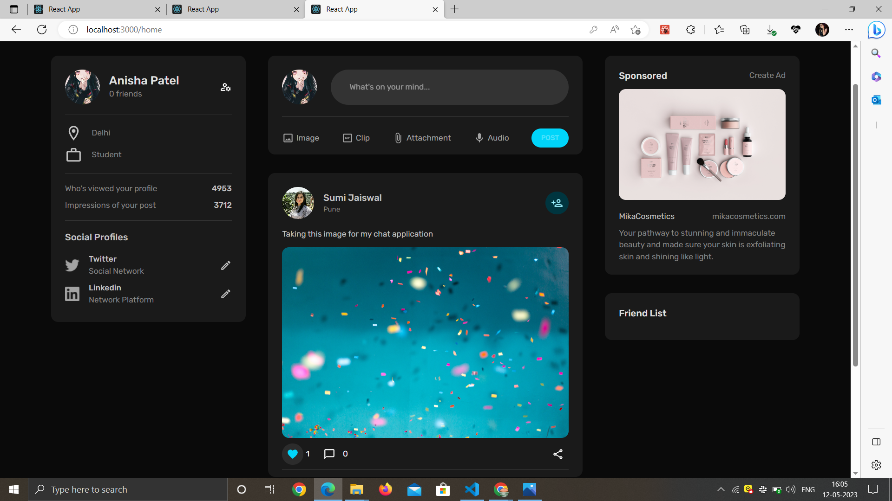

# FriendsBook

FriendsBook is a social media platform that allows users to connect and interact with friends. This repository contains the source code for the FriendsBook project.

## Features

1. **Register Page**: Users can create a new account by providing their details. 

   

2. **Login Page**: Registered users can log in to their accounts using their credentials.

   

3. **Home Page**: Users can view feeds.

   

4. **Dark Mode and Light Mode**: Users can switch between dark mode and light mode by clicking on an icon in the navbar.

    
    
5. **Make Friend**: Users can make friend by clicking on an icon in another users post.

    

6. **Unfriend**:  Users can unfriend by clicking on same icon by which they made friend.

    
  
7. **Like and Comment**:  Users can like and comment on any post.

    
    

    
    

